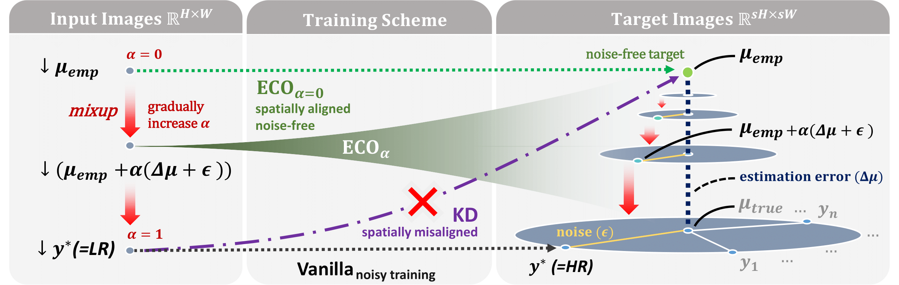
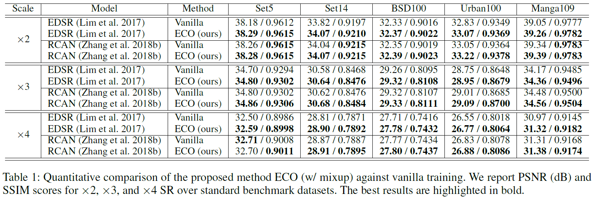

# [AAAI2024] Noise-free Optimization in Early Training Steps for Image Super-Resolution
Official Repository for AAAI2024 Noise-free Optimization in Early Training Steps for Image Super-Resolution (ECO). 

The Arxiv version contains additional supplementary material.\
[ArXiv] https://arxiv.org/abs/2312.17526 \
[AAAI] https://doi.org/10.1609/aaai.v38i4.28073

---

## Abstract
Recent deep-learning-based single image super-resolution (SISR) methods have shown impressive performance whereas typical methods train their networks by minimizing the pixel-wise distance with respect to a given high-resolution (HR) image. However, despite the basic training scheme being the predominant choice, its use in the context of ill-posed inverse problems has not been thoroughly investigated. In this work, we aim to provide a better comprehension of the underlying constituent by decomposing target HR images into two subcomponents: (1) the optimal centroid which is the expectation over multiple potential HR images, and (2) the inherent noise defined as the residual between the HR image and the centroid. Our findings show that the current training scheme cannot capture the ill-posed nature of SISR and becomes vulnerable to the inherent noise term, especially during early training steps. To tackle this issue, we propose a novel optimization method that can effectively remove the inherent noise term in the early steps of vanilla training by estimating the optimal centroid and directly optimizing toward the estimation. Experimental results show that the proposed method can effectively enhance the stability of vanilla training, leading to overall performance gain.


## Simple Code Snippet

Our method can be easily adapted to existing frameworks. We provide a simple code snippet so that users can quickly integrate this method without having to read and modify the entire codebase.
```
# sr_pretrained := image obtained by SR_pretrained(lr_original)
# lr_pretrained := MATLAB bicubic downsampled version of sr_pretrained

for lr_pretrained, sr_pretrained, lr_original, gt_original in dataloader:
    
    if noise_free_training:
        a = current_iter / total_iter  # modify noise scheduling if required.
        lr = (1-a)*lr_pretrained + a*lr_original
        gt = (1-a)*sr_pretrained + a*gt_original
    else: # vanilla training
        lr = lr_original
        gt = gt_original
    
    # train
    optim.zero_grad()
    out = sr_net(lr)
    loss = mse(out, gt)
    loss.backward()
    optim.step()
```

Note that in formal settings, lr_pretrained is downsampled from sr_pretrained with MATLAB downsampling functions (not pytorch / PIL / cv2).
Thus, lr_pretrained, sr_pretrained should be preprocessed before training. 
However, if it is a simple toy project where you don't require 1) strict computational efficiency and 2) fair comparison with previously released works/weights, you can simply do everything on flight.

You may modify the line for noise_scheduling if needed, but we did not observe significant difference.

_**Important**_:exclamation:
When implementing this on-flight, the pretrained SR network should be independent of the in-training network. Else it might collapse.
Additionally, using different resizing functions for training and testing may lead to performance drop. 
Note that despite using the (almost-)identically named _bicubic resize_ function, output values may differ based on the library.
(Refer to https://github.com/2minkyulee/Noise-free-Optimization-in-Early-Training-Steps-for-Image-Super-Resolution/issues/3#issuecomment-2149164158)


---
## Notes

:star:**Our implementation is based on DP (DataParallel).** \
DP may be faster than DDP without NVlinks. (https://huggingface.co/docs/transformers/v4.20.1/en/perf_train_gpu_many)

:star:**We use PIL to read images.** \
Consider using PIL-SIMD for faster I/O. \
Please note that our implementation takes images in the range of 0-1. \
Ensure to scale them accordingly when adapting to other frameworks.


:exclamation: **Notes on Downsampling with MATLAB** \
In official repositories, there is variation in how scripts generate bicubic downsampled images: some utilize the **im2double** function to increase precision, while others do not. Given that SR methods may be sensitive to such differences, we have manually downsampled all train/test images **_without_** using the **im2double** function, which is the de facto configuration. Both our models and the baseline models have been trained and tested using this consistently downsampled dataset.
The BasicSR version of our code will utilize the **im2double** function, aligning with the default configuration of the BasicSR framework.


:eyes: **Support and Feedback.** \
We are currently refining/cleaning-up our codebase. Should you encounter any issues or bugs, please do not hesitate to contact us. Your feedback is invaluable to our ongoing efforts to improve our work.


---

## Todo
:star:**Implementation based on BasicSR.** \
Currently, the codes are mostly implemented from scratch. We are in the process of adapting our implementation to integrate with BasicSR.


---


## Overall Framework of ECO



---


## Quantitative Results



---
## Pretrained Weights
Download pretrained weights of reproduced baselines and ours [here](https://drive.google.com/drive/folders/1JY_mnH780kKV9iEGcFDfa_dlvBEu-fKf?usp=sharing).


---
## Basic Usage

#### Example script for training
```
CUDA_VISIBLE_DEVICES=0 /opt/conda/bin/python3 train.py --wandb_name ECOO --config_template _largerbatch_EDSR_x2_ecoo2_mixup_lrx2_configs  # reproducing ours
CUDA_VISIBLE_DEVICES=1 /opt/conda/bin/python3 train.py --wandb_name ECOO --config_template _largerbatch_EDSR_x2_default_configs           # reproducing baseline
```

#### Example script for training with DP
```
# Providing more than 1 device will automatically start DP.
CUDA_VISIBLE_DEVICES=0,1 /opt/conda/bin/python3 train.py --wandb_name ECOO --config_template your_config  
```

#### Example script to resume training
```
# Manually provide wandb_id. If not, acts as normal training (without resuming).
CUDA_VISIBLE_DEVICES=0 /opt/conda/bin/python3 train.py --wandb_name ECOO --config_template your_config_name --wandb_id your_wandb_run_id
```

#### Example script for testing x3 SR with RCAN. 
```
CUDA_VISIBLE_DEVICES=0 /opt/conda/bin/python3 test.py \
--project_name RCAN_x3  \
--generator RCAN@RCAN_x3  \
--test_scale_factor 3  \
--mod 3  \
--save_path_test /YOUR_SAVE_PATH \
--test_path_imageHR /YOUR_DATA_PATH/sr_dataset_fp32/Urban100/HR \
--test_path_imageLR /YOUR_DATA_PATH/sr_dataset_fp32/Urban100/LRbicx3_fp32 \
--load_path_generator /YOUR_WEIGHT_PATH/rcan_x3_default_batchx8_cosine_best.pth \  # or any other RCAN_x3 weight, including ours. 
```
#### Example script for testing x2 SR with EDSR. 
```
CUDA_VISIBLE_DEVICES=1 /opt/conda/bin/python3 test.py \
--project_name EDSR_x2  \
--generator EDSR@EDSR_x2  \
--test_scale_factor 2  \
--mod 2  \
--save_path_test /YOUR_SAVE_PATH \
--test_path_imageHR /YOUR_DATA_PATH/sr_dataset_fp32/Urban100/HR \
--test_path_imageLR /YOUR_DATA_PATH/sr_dataset_fp32/Urban100/LRbicx2_fp32 \
--load_path_generator /YOUR_WEIGHT_PATH/edsr_x2_ECO2_batchx8_cosine_best.pth \  # or any other EDSR_x2 weight, including baseline.
```

---
## Acknowledgement
Our code is based on the following repositories. \
https://github.com/XPixelGroup/BasicSR \
https://github.com/sanghyun-son/EDSR-PyTorch \
https://github.com/yulunzhang/RCAN \
https://github.com/XPixelGroup/HAT \
https://github.com/cszn/KAIR/ \
https://github.com/JingyunLiang/SwinIR \
https://github.com/kligvasser/SANGAN \
https://github.com/chaofengc/IQA-PyTorch/


---


## Citation
Consider citing us if you find our paper useful in your research :smile:
```
@inproceedings{lee2024noise,
  title={Noise-free optimization in early training steps for image super-resolution},
  author={Lee, MinKyu and Heo, Jae-Pil},
  booktitle={Proceedings of the AAAI Conference on Artificial Intelligence},
  volume={38},
  number={4},
  pages={2920--2928},
  year={2024}
}
```

---


## Contact
Please contact me via 2minkyulee@gmail.com for any inquiries.


