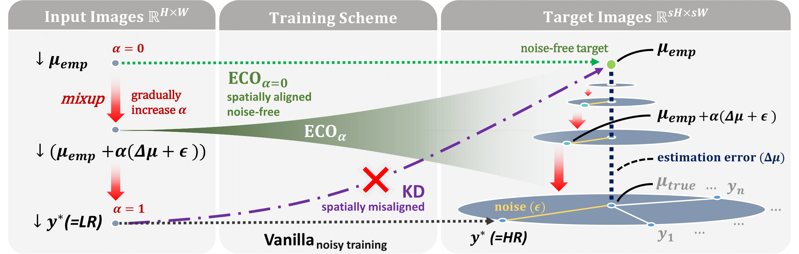

# [AAAI2024] Noise-free Optimization in Early Training Steps for Image Super-Resolution
Official Repository for AAAI2024 Noise-free Optimization in Early Training Steps for Image Super-Resolution (ECO). \
[ArXiv] https://arxiv.org/abs/2312.17526


### Abstract
Recent deep-learning-based single image super-resolution (SISR) methods have shown impressive performance whereas typical methods train their networks by minimizing the pixel-wise distance with respect to a given high-resolution (HR) image. However, despite the basic training scheme being the predominant choice, its use in the context of ill-posed inverse problems has not been thoroughly investigated. In this work, we aim to provide a better comprehension of the underlying constituent by decomposing target HR images into two subcomponents: (1) the optimal centroid which is the expectation over multiple potential HR images, and (2) the inherent noise defined as the residual between the HR image and the centroid. Our findings show that the current training scheme cannot capture the ill-posed nature of SISR and becomes vulnerable to the inherent noise term, especially during early training steps. To tackle this issue, we propose a novel optimization method that can effectively remove the inherent noise term in the early steps of vanilla training by estimating the optimal centroid and directly optimizing toward the estimation. Experimental results show that the proposed method can effectively enhance the stability of vanilla training, leading to overall performance gain.


## Overall Framework of ECO



## Update
🎉 [Dec 9] Our paper is accepted by AAAI 2024.


## Todo
⚡ Code release. \
⚡ Pretrained model release. 


## Quantitative Results
| Scale   | Model             | Method      | Set5   | Set14  | BSD100 | Urban100 | Manga109 |
|---------|-------------------|-------------|--------|--------|--------|----------|----------|
| x2     | EDSR  | Vanilla    | 38.18 / 0.9612 | 33.82 / 0.9197 | 32.33 / 0.9016 | 32.83 / 0.9349 | 39.05 / 0.9777 |
|        | EDSR  | ECO (ours) | **38.29** / **0.9615** | **34.07** / **0.9210** | **32.37** / **0.9022** | **33.07** / **0.9369** | **39.26** / **0.9782** |
|        | RCAN  | Vanilla    | 38.26 / **0.9615** | 34.04 / **0.9215** | 32.35 / 0.9019 | 33.05 / 0.9364 | 39.34 / **0.9783** |
|        | RCAN  | ECO (ours) | **38.28** / **0.9615** | **34.07** / **0.9215** | **32.39** / **0.9023** | **33.22** / **0.9378** | **39.39** / **0.9783** |
| x3     | EDSR  | Vanilla    | 34.70 / 0.9294 | 30.58 / 0.8468 | 29.26 / 0.8095 | 28.75 / 0.8648 | 34.17 / 0.9485 |
|        | EDSR  | ECO (ours) | **34.80** / **0.9302** | **30.64** / **0.8476** | **29.32** / **0.8108** | **28.95** / **0.8679** | **34.36** / **0.9496** |
|        | RCAN  | Vanilla    | 34.80 / 0.9302 | 30.62 / 0.8476 | 29.32 / 0.8107 | 29.01 / 0.8685 | 34.48 / 0.9500 |
|        | RCAN  | ECO (ours) | **34.86** / **0.9306** | **30.68** / **0.8484** | **29.33** / **0.8111** | **29.09** / **0.8700** | **34.56** / **0.9504** |
| x4     | EDSR  | Vanilla    | 32.50 / 0.8986 | 28.81 / 0.7871 | 27.71 / 0.7416 | 26.55 / 0.8018 | 30.97 / 0.9145 |
|        | EDSR  | ECO (ours) | **32.59** / **0.8998** | **28.90** / **0.7892** | **27.78** / **0.7432** | **26.77** / **0.8064** | **31.32** / **0.9182** |
|        | RCAN  | Vanilla    | **32.71** / 0.9008 | 28.87 / 0.7887 | 27.77 / 0.7434 | 26.83 / 0.8078 | 31.31 / 0.9168 |
|        | RCAN  | ECO (ours) | 32.70 / **0.9011** | **28.91** / **0.7895** | **27.80** / **0.7437** | **26.88** / **0.8086** | **31.38** / **0.9174** |

*Table 1*: Quantitative comparison of the proposed method ECO (w/ mixup) against vanilla training. We report PSNR (dB) and SSIM scores for x2, x3, and $\times$4 SR over standard benchmark datasets. The best results are highlighted in **bold**.


## Citation
Consider citing us if you find our paper useful in your research :)
```
@article{lee2023noise,
  title={Noise-free Optimization in Early Training Steps for Image Super-Resolution},
  author={Lee, MinKyu and Heo, Jae-Pil},
  journal={arXiv preprint arXiv:2312.17526},
  year={2023}
}
```

## Contact
Please contact me via 2minkyulee@gmail.com for any inquiries.
